<a href="https://charandeepkapoor.com"><picture><source media="(prefers-color-scheme: dark)" srcset="assets/hero-dark.svg"><source media="(prefers-color-scheme: light)" srcset="assets/hero-light.svg"></picture></a>

<a href="https://github.com/SirCharan?tab=repositories"><picture><source media="(prefers-color-scheme: dark)" srcset="assets/terminal-dark.svg"><source media="(prefers-color-scheme: light)" srcset="assets/terminal-light.svg"></picture></a>

<a href="https://github.com/SirCharan/claude-browse"><picture><source media="(prefers-color-scheme: dark)" srcset="assets/card-browse-dark.svg"><source media="(prefers-color-scheme: light)" srcset="assets/card-browse-light.svg"></picture></a>
<a href="https://github.com/SirCharan/second-brain"><picture><source media="(prefers-color-scheme: dark)" srcset="assets/card-second-brain-dark.svg"><source media="(prefers-color-scheme: light)" srcset="assets/card-second-brain-light.svg">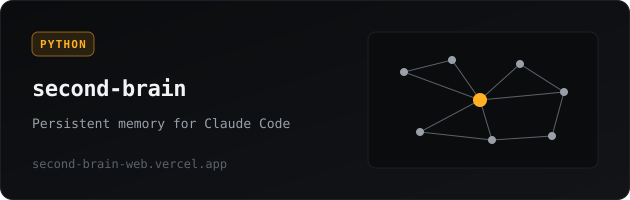</picture></a>

<a href="https://github.com/SirCharan/Zerodha-MCP-Trading"><picture><source media="(prefers-color-scheme: dark)" srcset="assets/card-zerodha-dark.svg"><source media="(prefers-color-scheme: light)" srcset="assets/card-zerodha-light.svg"></picture></a>
<a href="https://github.com/SirCharan/stocky-ai"><picture><source media="(prefers-color-scheme: dark)" srcset="assets/card-stocky-dark.svg"><source media="(prefers-color-scheme: light)" srcset="assets/card-stocky-light.svg"></picture></a>

<a href="https://github.com/SirCharan/stocky-fun"><picture><source media="(prefers-color-scheme: dark)" srcset="assets/card-stocky-fun-dark.svg"><source media="(prefers-color-scheme: light)" srcset="assets/card-stocky-fun-light.svg"></picture></a>
<a href="https://github.com/SirCharan/openwispr"><picture><source media="(prefers-color-scheme: dark)" srcset="assets/card-openwispr-dark.svg"><source media="(prefers-color-scheme: light)" srcset="assets/card-openwispr-light.svg"></picture></a>

<a href="https://github.com/SirCharan/continuum"><picture><source media="(prefers-color-scheme: dark)" srcset="assets/card-continuum-dark.svg"><source media="(prefers-color-scheme: light)" srcset="assets/card-continuum-light.svg"></picture></a>
<a href="https://github.com/SirCharan/claude-code-harness"><picture><source media="(prefers-color-scheme: dark)" srcset="assets/card-harness-dark.svg"><source media="(prefers-color-scheme: light)" srcset="assets/card-harness-light.svg"></picture></a>

<b>The rest of the shelf.</b> Options and futures analytics (<a href="https://github.com/SirCharan/trade-nexus">trade-nexus</a>), a manga recommender built the way a real feed works, behaviour-tracked and vector-backed (<a href="https://github.com/SirCharan/yomu">yomu</a>), an AI YouTube summariser (<a href="https://github.com/SirCharan/tldw">tldw</a>), and a BIP39 shard hunter (<a href="https://github.com/SirCharan/seed-hunter">seed-hunter</a>). Most of it started because I wanted to use it on a Monday morning.

<a href="https://github.com/SirCharan"><picture><source media="(prefers-color-scheme: dark)" srcset="assets/stats-dark.svg"><source media="(prefers-color-scheme: light)" srcset="assets/stats-light.svg"></picture></a>

<a href="https://charandeepkapoor.com"><picture><source media="(prefers-color-scheme: dark)" srcset="assets/footer-dark.svg"><source media="(prefers-color-scheme: light)" srcset="assets/footer-light.svg"></picture></a>

<a href="https://charandeepkapoor.com">charandeepkapoor.com</a> · <a href="https://x.com/yourasianquant">@yourasianquant</a> · <a href="https://www.linkedin.com/in/charandeep-kapoor/">LinkedIn</a>

