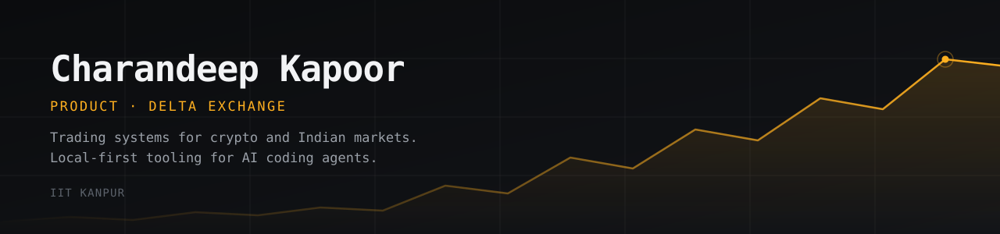

I build two things: systems that trade, and tooling that makes AI coding agents remember what they did.
Most of it started because I wanted to use it on a Monday morning.

### Currently shipping

| Project | What it is | |
|---|---|---|
| **[second-brain](https://github.com/SirCharan/second-brain)** | Persistent memory for Claude Code — hooks, skill, MCP server, workflows. A Markdown vault you own, no server and no account. | [site](https://second-brain-web.vercel.app) · Apache-2.0 |
| **[Zerodha-MCP-Trading](https://github.com/SirCharan/Zerodha-MCP-Trading)** | MCP server for Zerodha's Kite API. Gives an LLM the tools to read market data, run strategies and place orders on Indian equities and F&O. | Python |
| **[Stocky AI](https://github.com/SirCharan/stocky-ai)** | Trading assistant for Indian markets. Telegram bot over a FastAPI backend, with a six-agent council that argues the research before it answers. | [stockyai.xyz](https://stockyai.xyz) |
| **[openwispr](https://github.com/SirCharan/openwispr)** | Hold a hotkey, speak, the text lands at your cursor. Whisper runs on the Apple Neural Engine, so no audio leaves the Mac. | Swift · macOS |
| **[continuum](https://github.com/SirCharan/continuum)** | second-brain with the plugin removed — hooks only, stdlib Python, no dependencies. | MIT |

### The rest of the shelf

Options and futures analytics ([trade-nexus](https://github.com/SirCharan/trade-nexus)), a manga recommender built the way a real feed works — behaviour-tracked, vector-backed ([yomu](https://github.com/SirCharan/yomu)), a BIP39 shard hunter ([seed-hunter](https://github.com/SirCharan/seed-hunter)), and the harness I actually run Claude Code with ([claude-code-harness](https://github.com/SirCharan/claude-code-harness)).

Mostly Python and TypeScript, one Swift app, and more Jupyter notebooks than I'd like to admit.

### Elsewhere

[charandeepkapoor.com](https://charandeepkapoor.com) · [@yourasianquant](https://x.com/yourasianquant) · [LinkedIn](https://www.linkedin.com/in/charandeep-kapoor/)
